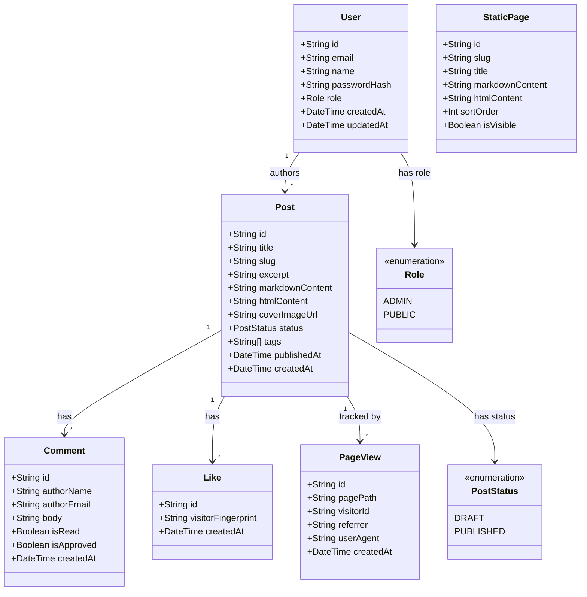
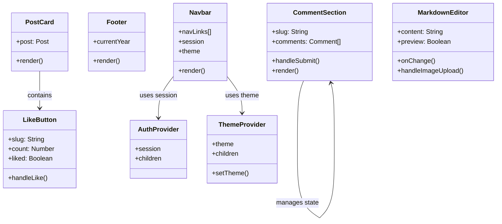
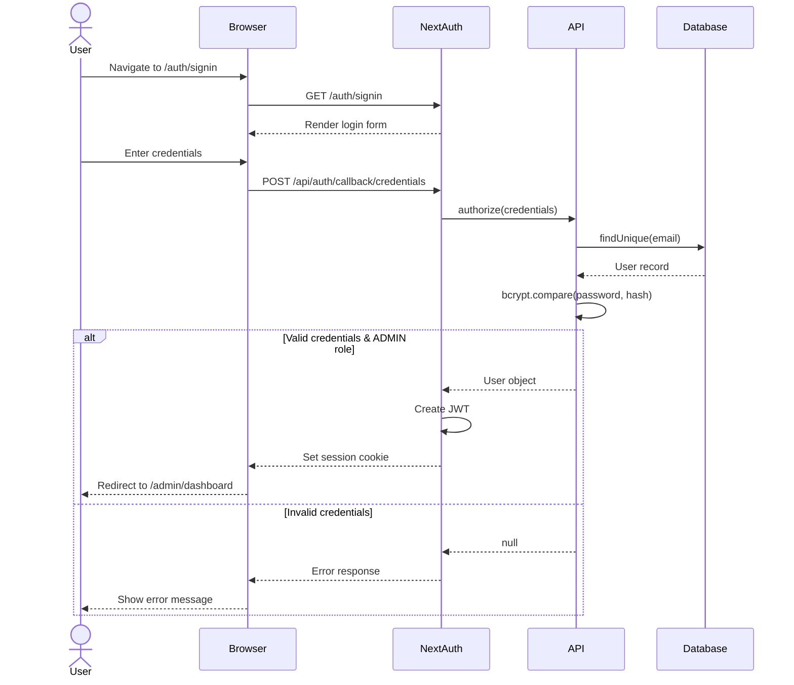
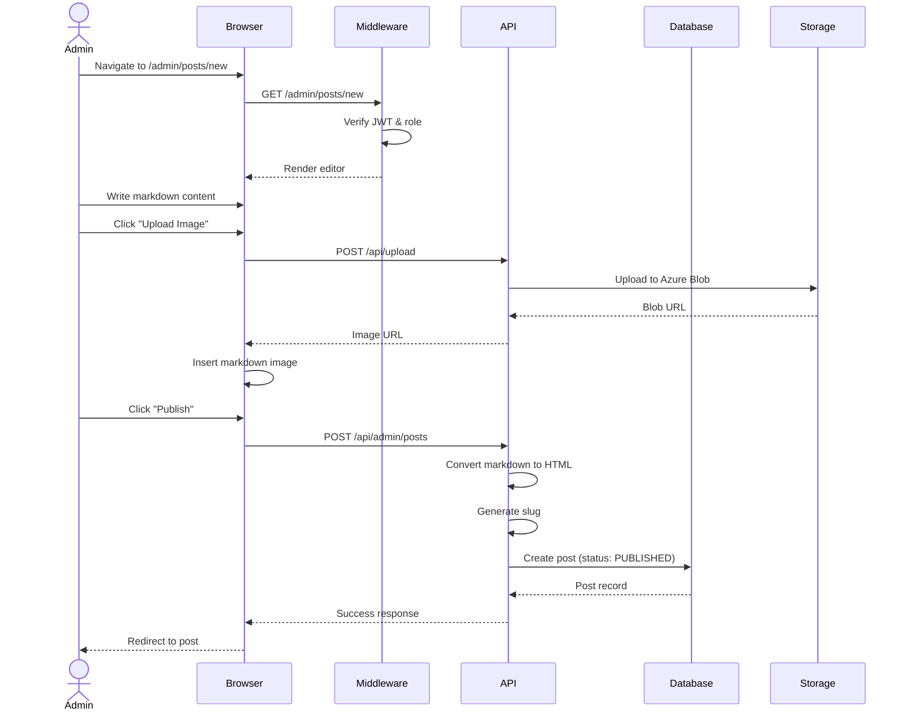
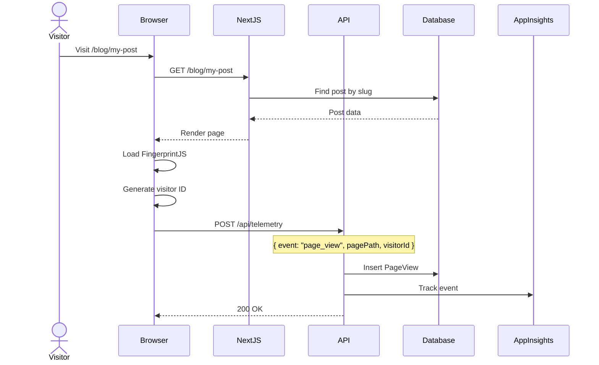
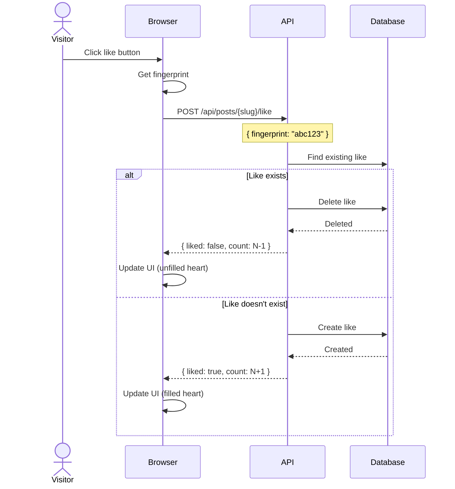
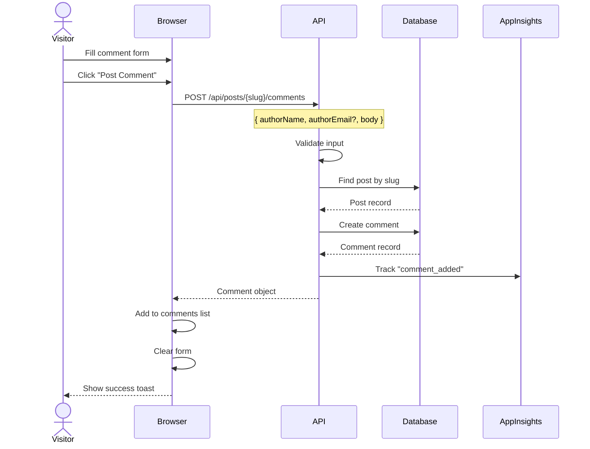

# System Design Documentation

This document provides comprehensive system design documentation for the Personal Blog Platform, including high-level architecture, low-level design, database schemas, infrastructure choices, and architectural diagrams.

## Table of Contents

1. [High Level Design (HLD)](#high-level-design-hld)
2. [Low Level Design (LLD)](#low-level-design-lld)
3. [Database Design](#database-design)
4. [Azure Infrastructure](#azure-infrastructure)
5. [Class Diagrams](#class-diagrams)
6. [Sequence Diagrams](#sequence-diagrams)
7. [API Design](#api-design)

---

## High Level Design (HLD)

### System Overview

The Personal Blog Platform is a modern, full-stack web application built with Next.js 14, deployed on Azure Kubernetes Service (AKS). It features role-based access control, markdown editing, a publish workflow, and built-in analytics.

### Architecture Diagram

```
┌─────────────────────────────────────────────────────────────────────────────┐
│                              INTERNET                                        │
└─────────────────────────────────────────────────────────────────────────────┘
                                    │
                                    ▼
┌─────────────────────────────────────────────────────────────────────────────┐
│                         GoDaddy DNS (prakharbansal.in)                       │
│                    A Record → 172.202.42.91 (Azure Static IP)                │
└─────────────────────────────────────────────────────────────────────────────┘
                                    │
                                    ▼
┌─────────────────────────────────────────────────────────────────────────────┐
│                     AZURE KUBERNETES SERVICE (AKS)                           │
│  ┌──────────────────────────────────────────────────────────────────────┐   │
│  │                    NGINX Ingress Controller                           │   │
│  │                    (TLS Termination via cert-manager)                 │   │
│  └──────────────────────────────────────────────────────────────────────┘   │
│                                    │                                         │
│                                    ▼                                         │
│  ┌──────────────────────────────────────────────────────────────────────┐   │
│  │                    Next.js Application (Pod)                          │   │
│  │    ┌─────────────┐  ┌─────────────┐  ┌─────────────────────────┐     │   │
│  │    │   SSR/ISR   │  │  API Routes │  │   Static Assets         │     │   │
│  │    │   Pages     │  │  /api/*     │  │   /_next/static/*       │     │   │
│  │    └─────────────┘  └─────────────┘  └─────────────────────────┘     │   │
│  └──────────────────────────────────────────────────────────────────────┘   │
└─────────────────────────────────────────────────────────────────────────────┘
          │                    │                         │
          ▼                    ▼                         ▼
┌─────────────────┐  ┌─────────────────┐  ┌─────────────────────────────────┐
│  PostgreSQL     │  │  Azure Redis    │  │  Azure Blob Storage             │
│  Flexible Server│  │  Cache          │  │  (blog-images container)        │
│  (Primary DB)   │  │  (Sessions)     │  │                                 │
└─────────────────┘  └─────────────────┘  └─────────────────────────────────┘
```

### Key Components

| Component | Technology | Purpose |
|-----------|------------|---------|
| Frontend | Next.js 14 (App Router) | SSR/SSG pages, React components |
| Backend | Next.js API Routes | REST API endpoints |
| Database | PostgreSQL Flexible Server | Primary data store |
| Cache | Azure Redis Cache | Session storage, query caching |
| Storage | Azure Blob Storage | Image uploads |
| Container Orchestration | AKS | Container management, scaling |
| Container Registry | Azure Container Registry | Docker image storage |
| TLS/SSL | cert-manager + Let's Encrypt | HTTPS certificates |
| Ingress | NGINX Ingress Controller | Traffic routing, load balancing |
| CI/CD | GitHub Actions | Automated builds and deployments |
| IaC | Bicep + Kustomize | Infrastructure as Code |

### Non-Functional Requirements

| Requirement | Target | Implementation |
|-------------|--------|----------------|
| Availability | 99.5% | AKS with health probes, multi-replica ready |
| Latency | < 200ms p95 | Edge caching, SSG for static pages |
| Security | HTTPS, RBAC | TLS 1.3, NextAuth.js, bcrypt passwords |
| Scalability | Horizontal | Kubernetes HPA, stateless pods |

---

## Low Level Design (LLD)

### Application Architecture

```
apps/web/
├── src/
│   ├── app/                    # Next.js App Router
│   │   ├── (public)/           # Public routes
│   │   │   ├── page.tsx        # Home
│   │   │   ├── blog/           # Blog listing & posts
│   │   │   ├── about/          # About page
│   │   │   └── contact/        # Contact page
│   │   ├── admin/              # Protected admin routes
│   │   │   ├── dashboard/      # Analytics dashboard
│   │   │   └── posts/          # Post management
│   │   ├── auth/               # Authentication
│   │   │   └── signin/         # Login page
│   │   ├── api/                # API endpoints
│   │   │   ├── admin/          # Admin APIs
│   │   │   ├── posts/          # Post CRUD
│   │   │   ├── telemetry/      # Analytics
│   │   │   └── upload/         # Image upload
│   │   └── version/            # Version endpoint
│   ├── components/
│   │   ├── blog/               # Blog components
│   │   ├── editor/             # Markdown editor
│   │   ├── layout/             # Navbar, Footer
│   │   └── providers/          # Context providers
│   ├── lib/                    # Utilities
│   │   ├── auth.ts             # NextAuth config
│   │   ├── prisma.ts           # DB client
│   │   ├── strings.ts          # Centralized strings
│   │   └── telemetry.ts        # Analytics helpers
│   └── middleware.ts           # Route protection
├── prisma/
│   ├── schema.prisma           # Database schema
│   ├── migrations/             # Migration files
│   └── seed.ts                 # Seed data
└── public/                     # Static assets
```

### Authentication Flow

The application uses **NextAuth.js** with a **Credentials Provider**:

1. **Password Storage**: Passwords are hashed using `bcryptjs` (12 rounds)
2. **Session Strategy**: JWT-based sessions
3. **Role-Based Access**: `ADMIN` and `PUBLIC` roles
4. **Route Protection**: Middleware checks `/admin/*` routes

```typescript
// Authentication configuration (simplified)
CredentialsProvider({
  credentials: {
    email: { type: "email" },
    password: { type: "password" }
  },
  authorize: async (credentials) => {
    const user = await prisma.user.findUnique({ where: { email } });
    if (!user || user.role !== "ADMIN") return null;
    const valid = await bcrypt.compare(password, user.passwordHash);
    return valid ? user : null;
  }
})
```

### Middleware Logic

```
Request → middleware.ts → Check path
                            │
                 ┌──────────┴──────────┐
                 │                     │
          /admin/* paths          Other paths
                 │                     │
                 ▼                     ▼
          Check JWT token        Pass through
                 │
        ┌────────┴────────┐
        │                 │
    Valid token      Invalid/Missing
    role=ADMIN            │
        │                 ▼
        ▼           Redirect to
    Continue        /auth/signin
```

---

## Database Design

### Why PostgreSQL?

| Factor | PostgreSQL | Alternative (MongoDB) | Decision |
|--------|------------|----------------------|----------|
| **Data Structure** | Relational with clear relationships | Document-based | Blog has clear relationships: Users → Posts → Comments |
| **ACID Compliance** | Full ACID | Eventually consistent | Critical for post publishing workflow |
| **Prisma Support** | First-class | Good | Prisma ORM works excellently with PostgreSQL |
| **Azure Integration** | Flexible Server (managed) | Cosmos DB | Native Azure managed service |
| **JSON Support** | JSONB columns | Native | Can store tags as JSON arrays |
| **Cost** | Lower for structured data | Higher at scale | Budget-friendly |

### Entity Relationship Diagram

```
┌─────────────────┐       ┌─────────────────┐       ┌─────────────────┐
│      User       │       │     Account     │       │     Session     │
├─────────────────┤       ├─────────────────┤       ├─────────────────┤
│ id (PK)         │──┐    │ id (PK)         │       │ id (PK)         │
│ email (unique)  │  │    │ userId (FK)     │───────│ userId (FK)     │
│ name            │  │    │ provider        │       │ sessionToken    │
│ passwordHash    │  └────│ providerAcctId  │       │ expires         │
│ role            │       │ access_token    │       └─────────────────┘
│ createdAt       │       │ refresh_token   │
│ updatedAt       │       └─────────────────┘
└─────────────────┘
         │
         │ 1:N
         ▼
┌─────────────────┐       ┌─────────────────┐       ┌─────────────────┐
│      Post       │       │    Comment      │       │      Like       │
├─────────────────┤       ├─────────────────┤       ├─────────────────┤
│ id (PK)         │──┐    │ id (PK)         │       │ id (PK)         │
│ title           │  │    │ postId (FK)     │───────│ postId (FK)     │
│ slug (unique)   │  │    │ authorName      │       │ visitorFprint   │
│ excerpt         │  │    │ authorEmail     │       │ createdAt       │
│ markdownContent │  └────│ body            │       └─────────────────┘
│ htmlContent     │       │ isRead          │              │
│ coverImageUrl   │       │ isApproved      │       (unique: postId +
│ status          │       │ createdAt       │        visitorFingerprint)
│ tags[]          │       └─────────────────┘
│ authorId (FK)   │
│ publishedAt     │       ┌─────────────────┐
│ createdAt       │       │    PageView     │
│ updatedAt       │       ├─────────────────┤
└─────────────────┘       │ id (PK)         │
         │                │ pagePath        │
         └────────────────│ postId (FK)     │
                          │ visitorId       │
                          │ referrer        │
                          │ userAgent       │
                          │ country         │
                          │ createdAt       │
                          └─────────────────┘

┌─────────────────┐       ┌─────────────────┐
│   StaticPage    │       │   LinkClick     │
├─────────────────┤       ├─────────────────┤
│ id (PK)         │       │ id (PK)         │
│ slug (unique)   │       │ pagePath        │
│ title           │       │ targetUrl       │
│ markdownContent │       │ linkText        │
│ htmlContent     │       │ visitorId       │
│ sortOrder       │       │ createdAt       │
│ isVisible       │       └─────────────────┘
│ createdAt       │
│ updatedAt       │
└─────────────────┘
```

### Schema Details

#### Core Entities

| Table | Purpose | Key Indexes |
|-------|---------|-------------|
| `users` | Admin accounts | `email` (unique) |
| `posts` | Blog articles | `slug` (unique), `(status, publishedAt)` |
| `comments` | Post comments | `(postId, createdAt)` |
| `likes` | Post likes | `(postId, visitorFingerprint)` unique |
| `static_pages` | About, Contact pages | `slug` (unique) |

#### Analytics Entities

| Table | Purpose | Key Indexes |
|-------|---------|-------------|
| `page_views` | Page visit tracking | `(pagePath, createdAt)`, `postId` |
| `link_clicks` | Outbound link tracking | `(pagePath, createdAt)` |

#### NextAuth Entities

| Table | Purpose |
|-------|---------|
| `accounts` | OAuth provider accounts |
| `sessions` | Active user sessions |
| `verification_tokens` | Email verification tokens |

---

## Azure Infrastructure

### Resource Overview

```
Resource Group: rg-blog-preprod
├── Azure Kubernetes Service (blog-preprod-aks)
├── Azure Container Registry (blogacruade2pz6fyows)
├── PostgreSQL Flexible Server (blog-preprod-pg)
├── Azure Redis Cache (blog-preprod-redis)
├── Storage Account (blogpreprodstuade2pz6fyo)
├── Key Vault (blog-preprod-kv)
├── Log Analytics Workspace (blog-preprod-logs)
├── Application Insights (blog-preprod-appins)
└── Static Public IP (blog-preprod-pip)
```

### Why These Resources?

| Resource | Choice | Why | Alternatives Considered |
|----------|--------|-----|------------------------|
| **AKS** | Kubernetes | Container orchestration, easy scaling, GitOps-ready | App Service (simpler but less flexible), ACI (no orchestration) |
| **PostgreSQL Flexible** | Managed PostgreSQL | Zero maintenance, automatic backups, HA options | Single Server (being deprecated), Azure SQL (overkill), CosmosDB (wrong data model) |
| **Redis Cache** | Azure Redis | Managed, low latency, session store | Self-hosted Redis (maintenance overhead) |
| **ACR** | Container Registry | Private, integrated with AKS, geo-replication | Docker Hub (public), GitHub Container Registry (external) |
| **Key Vault** | Secrets Management | Centralized secrets, audit logs, MSI integration | Environment variables (insecure), GitHub Secrets only (no runtime access) |
| **Blob Storage** | Object Storage | Cheap, CDN-ready, direct browser upload | Cosmos DB file attachments (expensive), database BLOBs (poor performance) |
| **App Insights** | APM & Logging | Full-stack telemetry, integrated with AKS | Self-hosted ELK (expensive), Datadog (costly) |

### Infrastructure Sizing

| Environment | Component | SKU | Reason |
|-------------|-----------|-----|--------|
| **Pre-prod** | AKS Nodes | Standard_DS2_v2 (1 node) | Cost-effective for testing |
| **Pre-prod** | PostgreSQL | Standard_B1ms (Burstable) | Low traffic, 32GB storage |
| **Pre-prod** | Redis | Basic C0 | Development caching |
| **Prod** | AKS Nodes | Standard_B4ms (2 nodes) | Production traffic |
| **Prod** | PostgreSQL | Standard_D2s_v3 (GP) | Higher IOPS, 64GB storage |
| **Prod** | Redis | Standard C1 | HA, persistence |

### Deployment Architecture

```
┌─────────────────────────────────────────────────────────────────┐
│                     GitHub Repository                            │
│  ┌─────────────┐   ┌─────────────┐   ┌─────────────────────┐    │
│  │ Source Code │   │ K8s Manifests│   │ Bicep Templates    │    │
│  │ apps/web/   │   │ k8s/        │   │ infra/             │    │
│  └─────────────┘   └─────────────┘   └─────────────────────┘    │
└─────────────────────────────────────────────────────────────────┘
         │                  │                    │
         │ Push to master   │                    │ Manual
         ▼                  ▼                    ▼
┌─────────────────────────────────────────────────────────────────┐
│                     GitHub Actions                               │
│  ┌──────────────────────────────────────────────────────────┐   │
│  │ 1. Build Docker Image (--build-arg COMMIT_SHA)           │   │
│  │ 2. Push to ACR                                            │   │
│  │ 3. kubectl apply -k k8s/overlays/preprod/                 │   │
│  └──────────────────────────────────────────────────────────┘   │
└─────────────────────────────────────────────────────────────────┘
         │
         │ OIDC Auth
         ▼
┌─────────────────────────────────────────────────────────────────┐
│                        Azure                                     │
│  ┌─────────────────┐        ┌─────────────────────────────────┐ │
│  │ ACR             │───────▶│ AKS                              │ │
│  │ blog-web:sha    │ pull   │ ┌─────────────────────────────┐ │ │
│  └─────────────────┘        │ │ Deployment: web              │ │ │
│                             │ │ - 1 replica                  │ │ │
│                             │ │ - Resources: 256Mi-512Mi     │ │ │
│                             │ │ - Health: /api/health        │ │ │
│                             │ └─────────────────────────────┘ │ │
│                             └─────────────────────────────────┘ │
└─────────────────────────────────────────────────────────────────┘
```

---

## Class Diagrams

### Domain Models (Prisma Schema)



### Component Architecture



---

## Sequence Diagrams

### User Authentication Flow



### Blog Post Creation Flow



### Page View Tracking Flow



### Like/Unlike Flow



### Comment Submission Flow



---

## API Design

### REST Endpoints

| Method | Endpoint | Auth | Description |
|--------|----------|------|-------------|
| `GET` | `/api/health` | - | Health check |
| `GET` | `/api/posts` | - | List published posts |
| `GET` | `/api/posts/{slug}` | - | Get single post |
| `POST` | `/api/posts/{slug}/like` | - | Toggle like |
| `GET` | `/api/posts/{slug}/comments` | - | List comments |
| `POST` | `/api/posts/{slug}/comments` | - | Add comment |
| `POST` | `/api/telemetry` | - | Track analytics event |
| `POST` | `/api/upload` | Admin | Upload image |
| `GET` | `/api/admin/posts` | Admin | List all posts |
| `POST` | `/api/admin/posts` | Admin | Create post |
| `PUT` | `/api/admin/posts/{slug}` | Admin | Update post |
| `DELETE` | `/api/admin/posts/{slug}` | Admin | Delete post |
| `GET` | `/api/admin/analytics` | Admin | Get dashboard data |
| `PATCH` | `/api/admin/comments` | Admin | Mark comments read |

### Response Formats

```typescript
// Success response
{
  "id": "clx...",
  "title": "My Post",
  "slug": "my-post",
  ...
}

// Error response
{
  "error": "Post not found",
  "code": "NOT_FOUND"
}

// Paginated response
{
  "data": [...],
  "pagination": {
    "page": 1,
    "limit": 10,
    "total": 50,
    "totalPages": 5
  }
}
```

---

## Deployment Environments

| Environment | URL | Branch | Deployment |
|-------------|-----|--------|------------|
| Local | `http://localhost:3000` | any | `npm run dev` |
| Pre-prod | `https://prakharbansal.in` | master | Auto on merge |
| Production | TBD | master | Manual dispatch |

### Version Tracking

Visit `/version` to see the deployed commit SHA:
- **Local**: Returns `local`
- **Deployed**: Returns git commit SHA (e.g., `6b98d64`)

---

## Security Considerations

1. **Authentication**: bcrypt password hashing (12 rounds)
2. **Authorization**: JWT-based sessions, middleware route protection
3. **Secrets**: Azure Key Vault + GitHub Secrets (never in code)
4. **Transport**: TLS 1.3 via Let's Encrypt
5. **CSRF**: Built-in NextAuth protection
6. **Input Validation**: Server-side validation on all endpoints
7. **SQL Injection**: Prisma ORM with parameterized queries

---

## Future Improvements

- [ ] Add Redis caching for frequently accessed posts
- [ ] Implement CDN for static assets (Azure CDN)
- [ ] Add rate limiting on public APIs
- [ ] Set up production environment with HA PostgreSQL
- [ ] Add automated database backups
- [ ] Implement search functionality (Azure AI Search or PostgreSQL full-text)
